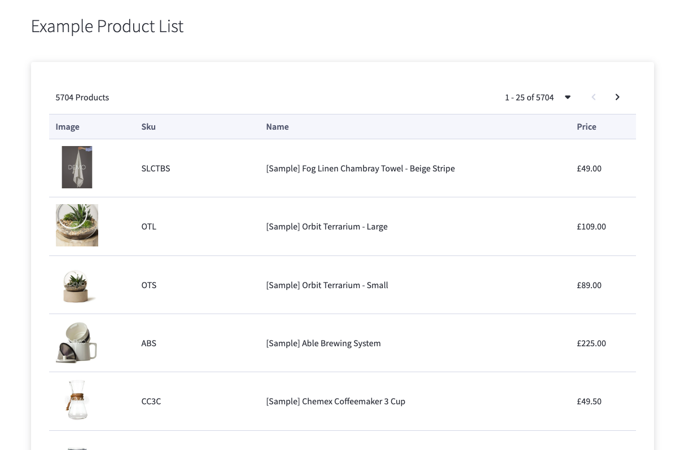

# Space48 - Starter Laravel and React App for Bigcommerce

This is a bare bones Laravel and React Bigcommerce app starter kit built by Space48.
Its purpose is to allow you to start building bigcommerce apps quickly and easily, 
with all the tools you need to develop a successful app.

Space48 apps built using this starter: 

[Automated Categories](https://www.bigcommerce.com/apps/automated-categories/) | 
[Category Merchandiser](https://www.bigcommerce.com/apps/category-merchandiser-by-space-48/) | 
[Mega Menu Builder](https://www.bigcommerce.com/apps/mega-menu-builder-by-space-48/) | 
[Page Scheduler](https://www.bigcommerce.com/apps/page-scheduler-by-space-48/) | 
[Metafields Manager](https://www.bigcommerce.com/apps/metafields-manager-by-space-48/) | 
[Store Locator](https://www.bigcommerce.com/apps/store-locator-by-space-48/)

## Features

- Bigcommerce request and response handling
- Manages Bigcommerce install/load/uninstall process flow
- Bigcommerce API Rate limiting
- Custom Events (e.g. Store Installed)
- Uses [BigDesign](https://developer.bigcommerce.com/big-design/) to create a platform-native look and feel
- Custom hooks
- Latest version of Laravel & React - PHP 8+, React 17+



## Prerequisites

To develop your Bigcommerce app, you’ll need:

- Bigcommerce sandbox store: <https://bigcommerce.com>
- Bigcommerce developer account: <https://developer.bigcommerce.com>
- A local developer environment - <https://laravel.com/docs/9.x/sail>


## Getting started

To get the app running locally, clone the repo and run:

`composer install`

`npm install`

Create a .env file by copying the env.example and amending for your local environment setup.

If using Laravel Sail then use `sail artisan` instead of `php artisan` going forward, and run:

`./vendor/bin/sail up`

Then:

`php artisan migrate`

`npm run dev`

Next, if you haven’t already, create an app on your Bigcommerce developer account. You’ll need to populate the following fields under the technical tab, to match your local development domain.

- Remove User Callback URL: **https://your-local-domain.com/api/bc/remove-user**
- Auth Callback URL: **https://your-local-domain.com/api/bc/install**
- Load Callback URL: **https://your-local-domain.com/api/bc/load**
- Uninstall Callback URL: **https://your-local-domain.com/api/bc/uninstall**

You’ll also need to set the following OAuth scopes:

- Information & Settings: **READ-ONLY**
- Products: **READ-ONLY** _(this can be removed later, if it’s not required)_


Once the app has been saved, copy the following details into the .env file:

```
BIGCOMMERCE_APP_ID=<shown in the URL when editing your app>
BIGCOMMERCE_CLIENT_ID=<shown via View Client ID>
BIGCOMMERCE_CLIENT_SECRET=<shown via View Client ID>
BIGCOMMERCE_WEBHOOK_SECRET=<Generate a unique code for this>
```

You’re now ready to install the app on your store.

## Customising your app

By default, the starter kit comes with the following:

- Dashboard page (products list example)
- Installation success page
- Welcome new user page
- Error page
- 404 page

These are found under:

`resources/js/pages`

You can also customize your logo by replacing the existing file here:

`public/img/logo.png`

## Testing

Tests can be ran via:

`php artisan test`


## Contributing

Pull requests are welcome. For major changes, please open an issue first to discuss what you would like to change.

## License

MIT